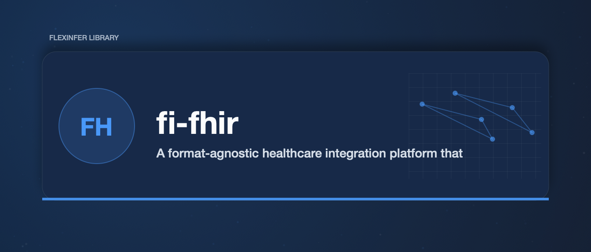

# fi-fhir

A format-agnostic healthcare integration platform that transforms legacy formats (HL7v2, CSV, EDI X12) into semantic events and routes them through configurable workflows.

[](https://gitlab.flexinfer.ai/libs/fi-fhir/-/commits/main)
[](https://gitlab.flexinfer.ai/libs/fi-fhir/-/commits/main)

## Overview

fi-fhir addresses a core problem in healthcare integration: **users think in workflow terms, but tools require format-specific knowledge**.

Instead of writing code that references `PID.3.1` or `OBX.5`, you work with semantic events like `patient_admit` and `lab_result`. The library handles format parsing, field mapping, validation, and routing automatically.




## Mapping Studio (UI)

The `ui/` app is a SvelteKit 5 “Mapping Studio” designed to make ETL approachable for non-developers: iterate on **samples → warnings → profile/workflow drafts → run/dry-run**.


See `ui/README.md` for the current UI roadmap and dev commands.

## Documentation

### Getting Started

- **[User Guide](docs/user-guide/README.md)** - Tutorials, concepts, and CLI reference
- **[Playground](https://flexinfer.ai/playground/fi-fhir)** - Interactive browser-based learning environment

### Developer Resources

- **[Developer Guide](docs/developer-guide/README.md)** - Architecture, contributing, and extension development
- **[AGENTS.md](AGENTS.md)** - AI assistant guidance and comprehensive architecture reference

### Reference

- **[Planning Documents](docs/planning/README.md)** - Technical specifications and design docs
- **[Architecture Diagrams](docs/diagrams/README.md)** - Generated package and call-graph diagrams

## Features

- **Multi-format parsing**: HL7v2, CSV/flatfiles, EDI X12 (837, 835, 270/271, 276/277)
- **Workflow DSL**: YAML-based routing with CEL expression filters
- **FHIR R4 output**: US Core profile mapper with Patient, Encounter, Observation, DiagnosticReport
- **Multiple actions**: FHIR, webhook, database (PostgreSQL/MySQL/SQLite), message queue (Kafka)
- **Reliability**: Retry with backoff, circuit breaker, dead letter queue, rate limiting
- **Observability**: Prometheus metrics, OpenTelemetry tracing, structured logging
- **Production-ready**: Helm chart, CI/CD pipelines, security hardening guide

## Installation

### CLI

```bash
# From source
go install gitlab.flexinfer.ai/libs/fi-fhir/cmd/fi-fhir@latest

# Or build locally
git clone https://gitlab.flexinfer.ai/libs/fi-fhir.git
cd fi-fhir
make build
```

### Docker

```bash
docker pull registry.gitlab.flexinfer.ai/libs/fi-fhir:latest
docker run -p 8080:8080 registry.gitlab.flexinfer.ai/libs/fi-fhir:latest
```

### Helm

```bash
helm install fi-fhir deploy/helm/fi-fhir/ \
  --set config.fhir.endpoint=https://fhir.example.com
```

## Quick Start

### 1. Parse a Message

```bash
# Parse HL7v2 ADT message
fi-fhir parse --format hl7v2 --pretty message.hl7

# Parse CSV patient file
fi-fhir parse --format csv --pretty patients.csv

# Parse EDI 837P claim
fi-fhir parse --format edi --pretty claim.edi
```

### 2. Run a Workflow

```bash
# Create workflow configuration
cat > workflow.yaml << 'EOF'
workflow:
  name: adt_routing
  version: "1.0"
  routes:
    - name: admits_to_fhir
      filter:
        event_type: patient_admit
      actions:
        - type: fhir
          endpoint: http://localhost:8090/fhir
          resource: Patient
        - type: log
          level: info
          message: "Patient admitted: {{.Patient.Name.Family}}"
EOF

# Process events through workflow
fi-fhir parse --format hl7v2 message.hl7 | \
  fi-fhir workflow run --config workflow.yaml

# Dry-run mode (no side effects)
fi-fhir workflow run --dry-run --config workflow.yaml event.json
```

### 3. Validate Configuration

```bash
fi-fhir workflow validate workflow.yaml
fi-fhir config validate
fi-fhir config show
```

## Supported Formats

### HL7 v2.x

| Message Type | Description | Semantic Event |
|--------------|-------------|----------------|
| ADT^A01 | Admit | `patient_admit` |
| ADT^A02 | Transfer | `patient_transfer` |
| ADT^A03 | Discharge | `patient_discharge` |
| ADT^A04 | Register (outpatient) | `patient_admit` |
| ADT^A08 | Update patient info | `patient_update` |
| ORU^R01 | Lab result | `lab_result` |
| SIU^S12-S15, S26 | Scheduling | `appointment_booked`, `appointment_cancelled` |

### EDI X12

| Transaction | Description | Semantic Event |
|-------------|-------------|----------------|
| 837P | Professional claim | `claim_submitted` |
| 837I | Institutional claim | `claim_submitted` |
| 835 | Remittance advice | `claim_response` |
| 270 | Eligibility inquiry | `eligibility_inquiry` |
| 271 | Eligibility response | `eligibility_response` |
| 276 | Claim status inquiry | `claim_status_inquiry` |
| 277 | Claim status response | `claim_status_response` |

`fi-fhir parse --format edi` emits semantic events for every transaction set above.
The parser also recognizes 278 and 834, but no event mappers exist for them yet;
those transaction sets parse to a generic `unknown_transaction` record.

### CSV/Flatfiles

- Automatic schema inference
- Patient demographics
- Lab results
- Custom record types

## Workflow DSL

### Filters

```yaml
filter:
  # Match by event type
  event_type: patient_admit
  event_type: [patient_admit, patient_transfer]

  # Match by source system
  source: epic_adt
  source: [epic_adt, cerner_adt]

  # CEL expressions for complex conditions
  condition: event.patient.age >= 65
  condition: event.observation.interpretation in ["critical", "HH"]
```

### Transforms

```yaml
transform:
  - set_field: patient.status = "active"
  - map_terminology: patient.race
  - redact: patient.ssn
```

### Actions

```yaml
actions:
  # FHIR server
  - type: fhir
    endpoint: https://fhir.example.com/r4
    resource: Patient
    auth:
      type: oauth2
      tokenUrl: https://auth.example.com/token
      clientId: ${CLIENT_ID}
      clientSecret: ${CLIENT_SECRET}

  # Webhook
  - type: webhook
    url: https://api.example.com/events
    method: POST
    headers:
      Authorization: Bearer ${API_KEY}

  # Database
  - type: database
    driver: postgres
    dsn: ${DATABASE_URL}
    operation: upsert
    table: events
    fields:
      patient_mrn: "{{.Patient.MRN}}"
      event_type: "{{.Type}}"

  # Message queue
  - type: queue
    driver: kafka
    brokers: ${KAFKA_BROKERS}
    topic: healthcare-events
    key: "{{.Patient.MRN}}"

  # Logging
  - type: log
    level: info
    message: "Processed: {{.Type}} for {{.Patient.MRN}}"
```

## TypeScript SDK

```bash
npm install @fi-fhir/sdk
```

```typescript
import { parseHL7, Workflow } from '@fi-fhir/sdk';

const event = await parseHL7(hl7Message, { source: 'epic_adt' });

const workflow = new Workflow('./workflow.yaml');
await workflow.validate();
const output = await workflow.run([event]);
```

## All Documentation

| Document | Description |
|----------|-------------|
| **User Guide** | |
| [Getting Started](docs/user-guide/getting-started.md) | First-time setup and tutorials |
| [Core Concepts](docs/user-guide/core-concepts.md) | Architecture and design philosophy |
| [CLI Reference](docs/user-guide/cli-reference.md) | Complete command reference |
| [Source Profiles](docs/user-guide/source-profiles.md) | Profile configuration guide |
| [Workflows](docs/user-guide/workflows.md) | Workflow DSL reference |
| [FHIR Output](docs/user-guide/fhir-output.md) | FHIR R4 mapping details |
| [Playground Tutorial](docs/user-guide/playground-tutorial.md) | Interactive learning guide |
| **Developer Guide** | |
| [Architecture](docs/developer-guide/architecture.md) | System architecture overview |
| [Development Setup](docs/developer-guide/development-setup.md) | Environment setup |
| [Adding Parsers](docs/developer-guide/adding-parser.md) | Format parser development |
| [Testing](docs/developer-guide/testing.md) | Testing guidelines |
| **Operations** | |
| [Production Hardening](docs/operations/PRODUCTION-HARDENING.md) | Security hardening guide |
| [Operations Runbook](docs/operations/RUNBOOK.md) | Troubleshooting and operations |
| **Reference** | |
| [AGENTS.md](AGENTS.md) | AI assistant guidance and architecture |
| [CHANGELOG.md](CHANGELOG.md) | Release history |
| [API Reference](api/openapi.yaml) | OpenAPI 3.1 specification |
| [Example Workflows](examples/README.md) | Ready-to-use workflow templates |

## Development

```bash
# Build
make build

# Test
make test              # Unit tests
make test-e2e          # E2E tests
make test-integration  # Integration tests (requires Docker)

# Lint
make lint

# Run benchmarks
make bench

# Docker
make docker-build
```

### Local Development Stack

```bash
# Start dependencies (PostgreSQL, Kafka, FHIR server, Jaeger)
docker-compose up -d

# Run with local config
./bin/fi-fhir workflow run --config examples/workflows/adt-to-fhir.yaml
```

## Deployment

### Docker Compose

```bash
docker-compose up -d
# API: http://localhost:8080
# Metrics: http://localhost:9090/metrics
```

### Kubernetes

```bash
kubectl apply -k deploy/kubernetes/base/
# Or with production overlay
kubectl apply -k deploy/kubernetes/overlays/production/
```

### Helm

```bash
helm install fi-fhir deploy/helm/fi-fhir/ \
  --set replicaCount=3 \
  --set config.database.enabled=true \
  --set ingress.enabled=true \
  --set ingress.hosts[0].host=fi-fhir.example.com
```

## Observability

### Metrics (Prometheus)

```
workflow_events_processed_total
workflow_action_duration_seconds
workflow_action_errors_total
workflow_dlq_size
workflow_circuit_breaker_state
```

### Tracing (OpenTelemetry)

Configure via environment:

```bash
export FI_FHIR_TRACING_ENABLED=true
export OTEL_EXPORTER_OTLP_ENDPOINT=http://jaeger:4318
```

### Health Checks

- `/health` - Liveness probe
- `/ready` - Readiness probe (checks dependencies)
- `/metrics` - Prometheus metrics

## Project Structure

```
fi-fhir/
├── cmd/fi-fhir/           # CLI entry point
├── internal/
│   ├── parser/            # Format parsers (hl7v2, csv, edi)
│   ├── semantic/          # Event transformation
│   └── workflow/          # Workflow engine
├── pkg/
│   ├── events/            # Public semantic event types
│   ├── config/            # Configuration management
│   ├── profile/           # Source profiles
│   └── validate/          # Identifier validators (NPI, MBI, SSN)
├── api/                   # OpenAPI specification
├── deploy/
│   ├── helm/              # Helm chart
│   └── kubernetes/        # Kustomize manifests
├── dashboards/            # Grafana dashboards & alerting rules
├── examples/              # Example workflows
├── sdk/typescript/        # TypeScript SDK
└── test/e2e/              # End-to-end tests
```

## Contributing

See [AGENTS.md](AGENTS.md) for architecture guidance and coding conventions.

## License

Apache License 2.0 - see [LICENSE](LICENSE)
