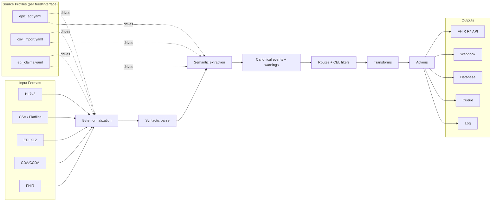
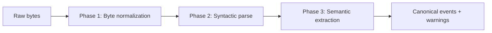

# fi-fhir Planning Documents

This directory contains detailed planning and specification documents for the fi-fhir healthcare integration library.

## Document Overview

| Document | Purpose | Status |
|----------|---------|--------|
| [SOURCE-PROFILES.md](SOURCE-PROFILES.md) | Source Profile configuration system - the unit of scalability | ⚠️ Core complete, profile inference pending |
| [WORKFLOW-DSL.md](WORKFLOW-DSL.md) | Workflow routing, transforms, and actions | ⚠️ Core complete, email/file/custom actions pending |
| [FHIR-PROFILES.md](FHIR-PROFILES.md) | FHIR R4 output with US Core mapping | ⚠️ 17+ resources, validation pending |
| [HL7V2-QUIRKS.md](HL7V2-QUIRKS.md) | HL7 v2.x version differences and parsing edge cases | ⚠️ Core complete, vendor templates pending |
| [EDI-COMPLEXITIES.md](EDI-COMPLEXITIES.md) | X12 EDI parsing (837P, 835, 270/271, 276/277) | ⚠️ Parsing complete, companion guides pending |
| [IDENTIFIERS.md](IDENTIFIERS.md) | Patient/provider identifier systems and validation | ✅ Complete (validators + matching engine) |
| [TERMINOLOGY.md](TERMINOLOGY.md) | Healthcare code systems and mapping (LOINC, SNOMED, UMLS, ICD-10-CM) | ⚠️ Core complete, version tracking pending |
| [TYPESCRIPT-SDK.md](TYPESCRIPT-SDK.md) | TypeScript/JavaScript SDK | ⚠️ SDK complete, distribution pending |
| [CDA-CCDA.md](CDA-CCDA.md) | CDA/CCDA clinical document parsing | ✅ Complete |
| [FHIR-SUBSCRIPTIONS.md](FHIR-SUBSCRIPTIONS.md) | FHIR R4 Subscriptions (bidirectional) | ✅ Complete |
| [GRAPHQL-API.md](GRAPHQL-API.md) | GraphQL API layer for events | ✅ Complete |
| [EVENT-SOURCING.md](EVENT-SOURCING.md) | Event sourcing / CQRS patterns | ✅ Complete |

## Architecture Overview

See also [Architecture Diagrams](../diagrams/README.md) for generated package and call-graph diagrams.

## Reading Order

For new contributors, recommended reading order:

1. **[SOURCE-PROFILES.md](SOURCE-PROFILES.md)** - Understand the core abstraction (profile-per-feed)
2. **[HL7V2-QUIRKS.md](HL7V2-QUIRKS.md)** - Learn why profiles are necessary (real-world variations)
3. **[IDENTIFIERS.md](IDENTIFIERS.md)** - Understand healthcare identifier complexity
4. **[TERMINOLOGY.md](TERMINOLOGY.md)** - Learn about code system mapping
5. **[WORKFLOW-DSL.md](WORKFLOW-DSL.md)** - See how events get routed to actions
6. **[FHIR-PROFILES.md](FHIR-PROFILES.md)** - Understand FHIR output requirements
7. **[EDI-COMPLEXITIES.md](EDI-COMPLEXITIES.md)** - Deep dive on claims processing
8. **[TYPESCRIPT-SDK.md](TYPESCRIPT-SDK.md)** - SDK for JavaScript/TypeScript usage

## Key Concepts

### Source Profiles
The unit of scalability is a **Source Profile** (per interface/feed), not "HL7v2 support" in general. Each profile controls:
- Parsing tolerance (missing segments, extra components)
- Z-segment extraction and mapping
- Identifier normalization and validation
- Terminology mapping rules
- Event classification (A01 → inpatient vs outpatient)

### Canonical Events
All input formats map to semantic events (`patient_admit`, `lab_result`, `claim_submitted`). This decouples:
- Input parsing from business logic
- Workflow routing from format specifics
- FHIR generation from source system

### Workflow Engine
Events flow through configurable routes with:
- Filters (event type, source, CEL conditions)
- Transforms (set_field, map_terminology, redact)
- Actions (FHIR, webhook, database, queue, log)

## Implementation Status

The backlog of remaining work is documented in the [Backlog section](#backlog-prioritized) below.
For AI assistant guidance, see [AGENTS.md](../../AGENTS.md).

### Completed
- HL7v2 parsing (ADT, ORU, SIU messages)
- CSV parsing with schema inference
- EDI X12 parsing (837P, 835)
- Source Profile system
- Identifier validators (NPI, MBI, SSN, DEA)
- Terminology mapper
- Workflow engine with FHIR action
- CEL condition evaluation for workflow filters
- Transform pipeline (set_field, map_terminology, redact)
- TypeScript SDK
- OAuth2 client credentials for FHIR action
- Database action (PostgreSQL, MySQL, SQLite)
- Queue action (Kafka, RabbitMQ, NATS, SQS)
- EDI 270/271 eligibility transactions
- EDI 276/277 claim status transactions
- Retry/error handling with exponential backoff
- OAuth2 token refresh with 401 handling
- Circuit breaker pattern for failing external services
- Dead letter queue for failed events
- Rate limiting for high-volume event streams
- Metrics/observability instrumentation
- Prometheus metrics adapter (reference implementation)
- Distributed tracing with OpenTelemetry
- Grafana dashboard templates (`dashboards/grafana/`)
- Event sourcing / CQRS patterns (store, projections, CLI)
- Workflow action for event store integration
- GraphQL queries for projections
- Projection resolver wiring (GraphQL → projection service layer)
- PostgreSQL-backed snapshot store for projection recovery
- Event replay tooling (ProjectionRebuilder with progress, dry-run, snapshot-aware)
- Batch event submission endpoint (submitBatch mutation with parallel/sequential modes)
- PostgreSQL integration tests (testcontainers for EventStore, CheckpointStore, SnapshotStore)
- Projection rebuild from time range (TimeRangeEventStore interface, point-in-time recovery)
- Event archival and retention policies (HIPAA-aware retention, file archive, deletion)
- Event stream compaction (aggregate snapshots, incremental compaction, bulk prefix compaction)
- Saga orchestration (multi-step transactions with compensation, retry, timeout)
- Outbox pattern for reliable event publishing (OutboxStore, OutboxRelay, OutboxEventStore)
- LOINC file loader with panel expansion (`pkg/terminology/loinc.go`)
- ICD-10-CM loader with ETL pipeline integration (`pkg/terminology/db/icd10.go`)
- Fuzzy terminology matching with confidence scoring (`pkg/terminology/fuzzy.go`)
- FHIR Condition resource (US Core profile) - `pkg/fhir/mapper.go:MapCondition()`
- FHIR Coverage resource (US Core profile) - `pkg/fhir/mapper.go:MapCoverage()`
- Da Vinci PAS Claim resource (for 837P → FHIR) - `pkg/fhir/mapper.go:MapClaim()`
- PDex ExplanationOfBenefit resource (for 835 → FHIR) - `pkg/fhir/mapper.go:MapExplanationOfBenefit()`
- CoverageEligibilityResponse resource (for 271 → FHIR) - `pkg/fhir/mapper.go:MapCoverageEligibilityResponse()`
- FHIR Procedure resource (US Core profile) - `pkg/fhir/mapper.go:MapProcedure()`
- FHIR Immunization resource (US Core profile) - `pkg/fhir/mapper.go:MapImmunization()`
- FHIR Observation (Vital Signs) - `pkg/fhir/mapper.go:MapVitalSign()` (8 specific US Core profiles)
- FHIR MedicationRequest resource (US Core profile) - `pkg/fhir/mapper.go:MapMedicationRequest()`
- FHIR AllergyIntolerance resource (US Core profile) - `pkg/fhir/mapper.go:MapAllergyIntolerance()`
- FHIR CarePlan resource (US Core profile) - `pkg/fhir/mapper.go:MapCarePlan()`
- FHIR Goal resource (US Core profile) - `pkg/fhir/mapper.go:MapGoal()`
- FHIR CareTeam resource (US Core profile) - `pkg/fhir/mapper.go:MapCareTeam()`
- FHIR ServiceRequest resource (US Core profile) - `pkg/fhir/mapper.go:MapServiceRequest()`
- FHIR DocumentReference resource (US Core profile) - `pkg/fhir/mapper.go:MapDocumentReference()`
- FHIR DiagnosticReport (clinical notes) resource (US Core profile) - `pkg/fhir/mapper.go:MapDiagnosticReportNote()`
- FHIR Provenance resource (US Core profile) - `pkg/fhir/mapper.go:MapProvenance()`
- FHIR Location resource (US Core profile) - `pkg/fhir/mapper.go:MapLocation()`
- FHIR Organization resource (US Core profile) - `pkg/fhir/mapper.go:MapOrganization()`
- FHIR Practitioner resource (US Core profile) - `pkg/fhir/mapper.go:MapPractitioner()`
- FHIR PractitionerRole resource (US Core profile) - `pkg/fhir/mapper.go:MapPractitionerRole()`
- FHIR RelatedPerson resource (US Core profile) - `pkg/fhir/mapper.go:MapRelatedPerson()`
- UMLS API integration - `pkg/terminology/umls.go:UMLSClient`
  - Cross-walk queries (ICD-10 ↔ SNOMED, RxNorm ↔ NDC)
  - Concept normalization and search
  - Rate limiting and caching
  - Ticket-based authentication
- GraphQL triggerWorkflow mutation - `internal/api/graphql/resolvers/schema.resolvers.go`
- GraphQL FHIR subscription CRUD mutations - `internal/api/graphql/resolvers/schema.resolvers.go`
- GraphQL workflow event notifications (pub/sub) - `internal/api/graphql/resolvers/resolver.go`
- CEL expression evaluation in FHIR subscription mapper - `internal/fhir/subscription/mapper.go`
- OAuth2 client credentials for FHIR subscriptions - `internal/fhir/subscription/router.go`
- Patient Matching Engine - `pkg/matching/`
  - Deterministic matching rules (SSN, MBI, MRN exact match)
  - Probabilistic scoring (Jaro-Winkler, Soundex, Levenshtein)
  - Combined matcher with configurable thresholds
  - MPI interface abstraction with in-memory implementation
  - Batch matching with blocking keys

---

## Backlog (Prioritized)

The following items remain for full production readiness:

### P0 - Critical (TODOs in Production Code)

✅ **All P0 items complete** (resolved 2026-01-10)

| Location | Status |
|----------|--------|
| `internal/api/graphql/resolvers/schema.resolvers.go` | ✅ `triggerWorkflow` mutation implemented |
| `internal/api/graphql/resolvers/schema.resolvers.go` | ✅ FHIR subscription CRUD mutations implemented |
| `internal/api/graphql/resolvers/schema.resolvers.go` | ✅ Workflow event notifications via pub/sub |
| `internal/fhir/subscription/mapper.go` | ✅ CEL expression evaluation using workflow.CELEvaluator |
| `internal/fhir/subscription/router.go` | ✅ OAuth2 client credentials via OAuth2Auth provider |

### P1 - High Priority (Planned but Not Implemented)

| Feature | Planned In | Notes |
|---------|------------|-------|
| ✅ Patient Matching Engine | [IDENTIFIERS.md](IDENTIFIERS.md) | Implemented in `pkg/matching/` (2026-01-10) |
| EDI Companion Guide Framework | [EDI-COMPLEXITIES.md](EDI-COMPLEXITIES.md) | Payer-specific parsing rules (Medicare, Blue Cross, etc.) |

### P2 - Test Coverage Gaps

| Area | Current Coverage | Target | Notes |
|------|------------------|--------|-------|
| CLI (`cmd/fi-fhir/`) | 40.7% | 80%+ | Improved with offline stubs; limited by external service deps (MinIO, PostgreSQL) |
| Terminology (db) | 7.2% | 80%+ | Requires PostgreSQL testcontainers |
| CDA Parser | 87.1% | 80%+ | ✅ Above target |
| ✅ GraphQL Resolvers | 80.8% | 80%+ | |
| ✅ FHIR Subscription | 84.7% | 80%+ | |
| ✅ Terminology (pkg) | 66.9% | 80%+ | Core pkg good, db layer needs work |
| ✅ FHIR Parser | 92.5% | 80%+ | |
| ✅ Workflow Engine | 79.5% | 80%+ | |

### P3 - Future Enhancements

- Additional HL7v2 message types (VXU, MDM, RDE, DFT)
- CDA/CCDA section expansion (Medications, Allergies, Social History)
- Test data organization and edge case fixtures

---

## Contributing

When adding new planning documents:
1. Follow the existing format (Overview → Details → Implementation Plan → See Also → References)
2. Include a "See Also" section linking related docs
3. Mark implementation status with checkboxes and file path references
4. Update this README with the new document
