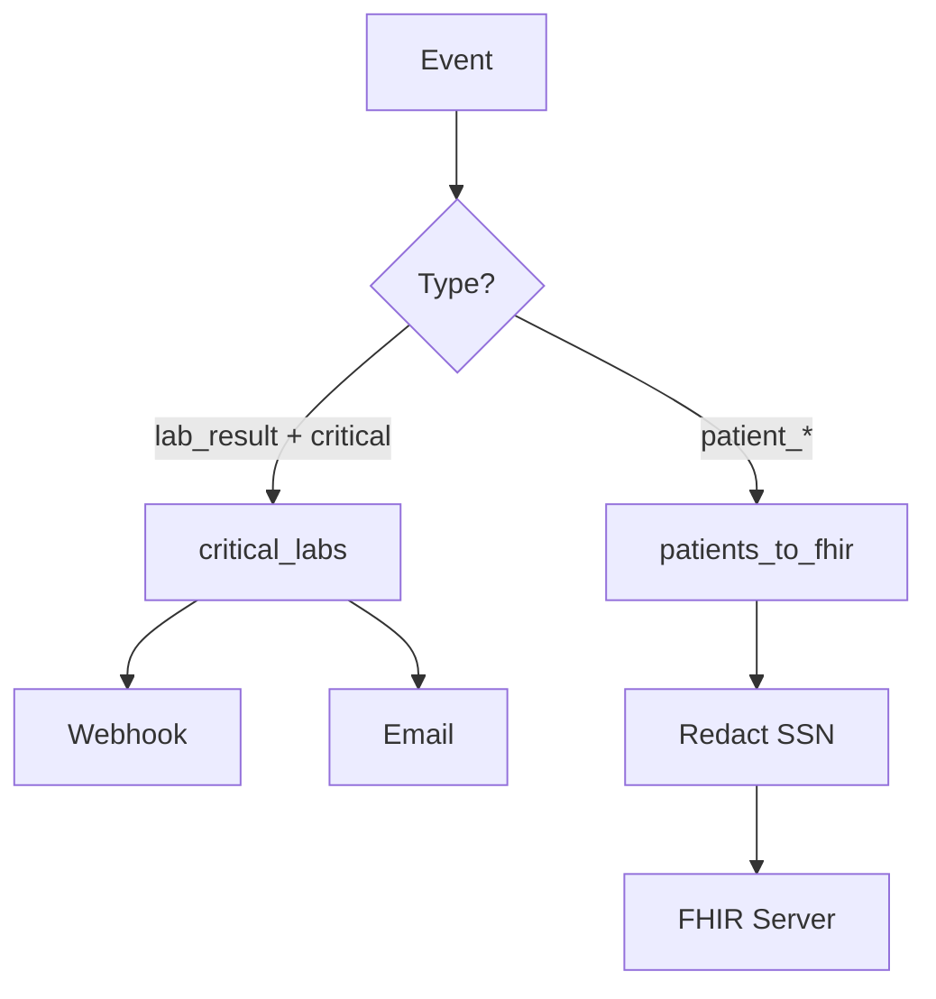

# LLM-Powered Features

fi-fhir integrates with Large Language Models (LLMs) to provide intelligent assistance for healthcare data integration tasks. This guide covers the AI-powered features available in the CLI and UI.

## Overview

LLM features enhance fi-fhir with:

- **Warning Explanations**: Human-readable explanations for parse warnings
- **Clinical Entity Extraction**: Extract structured data from clinical notes
- **Data Quality Analysis**: Holistic data quality scoring with recommendations
- **Workflow Generation**: Create workflows from natural language descriptions
- **CEL Expression Assistance**: Generate filter expressions from plain English
- **Semantic Terminology Search**: Find codes by meaning, not just string matching

## Configuration

LLM features require an OpenAI-compatible API endpoint. Configure in your config file or environment:

```yaml
llm:
  enabled: true
  base_url: "http://localhost:8000/v1"  # LiteLLM, vLLM, or OpenAI
  api_key: "${LLM_API_KEY}"
  default_model: "qwen3-8b-fast"        # Fast model for simple tasks
  quality_model: "qwen3-14b-quality"    # Better model for complex tasks
  timeout: 30s
  max_retries: 3
```

Environment variables — the canonical namespace is `FI_FHIR_LLM_*`:
```bash
export FI_FHIR_LLM_ENABLED=true
export FI_FHIR_LLM_BASE_URL="http://localhost:8000/v1"
export FI_FHIR_LLM_API_KEY="your-api-key"
export FI_FHIR_LLM_DEFAULT_MODEL="qwen3-8b-fast"
export FI_FHIR_LLM_QUALITY_MODEL="qwen3-14b-quality"
```

`FI_FHIR_LLM_*` names are canonical for runtime configuration. Legacy `LLM_*`
names remain supported as fallbacks for existing deployments:

| Canonical | Legacy fallback | Purpose |
|-----------|-----------------|---------|
| `FI_FHIR_LLM_BASE_URL` | `LLM_BASE_URL` | OpenAI-compatible provider base URL |
| `FI_FHIR_LLM_API_KEY` | `LLM_API_KEY`, then `OPENAI_API_KEY` | Provider API key |
| `FI_FHIR_LLM_DEFAULT_MODEL` | `LLM_DEFAULT_MODEL` | Fast/default completion model |
| `FI_FHIR_LLM_QUALITY_MODEL` | `LLM_QUALITY_MODEL` | Higher-quality reasoning model |

When both canonical and legacy variables are set, the canonical
`FI_FHIR_LLM_*` value wins.

### Runtime Capability

GraphQL exposes a safe capability query for UI and operator checks:

```graphql
query {
  llmCapability {
    enabled
    configured
    providerBaseURLHost
    defaultModel
    qualityModel
    status
    warnings
    features {
      name
      enabled
      status
      reason
      model
    }
  }
}
```

The response never includes API keys or the full provider URL. Top-level
`status` is one of `disabled`, `unavailable`, `degraded`, or `available`.
Feature rows use the same vocabulary, with `unconfigured` for optional features
that cannot be wired in the current runtime.

`fi-fhir serve` also honors `FI_FHIR_LLM_ENABLED=false` as an explicit off switch
for GraphQL LLM resolvers. If `FI_FHIR_LLM_ENABLED` is unset, serve preserves the
legacy behavior of attempting LLM setup from the configured endpoint/model values.

---

## Warning Explanations

Parse warnings like `INVALID_NPI` or `MISSING_PV1` require HL7v2 expertise to understand. LLM explanations help integration analysts fix issues without deep format knowledge.

### CLI Usage

```bash
# Explain warnings during parsing
fi-fhir parse --explain-warnings --format hl7v2 message.hl7

# Output includes explanations
{
  "warnings": [
    {
      "code": "INVALID_NPI",
      "message": "Invalid NPI checksum in PV1-7",
      "path": "PV1.7.1",
      "explanation": "The National Provider Identifier (NPI) failed checksum validation. NPIs are 10-digit numbers where the last digit is a Luhn check digit.",
      "fix_suggestion": "Verify the NPI with the provider or check NPPES registry. Common issues include transposed digits or using a legacy provider ID.",
      "impact": "Claims may be rejected. Patient attribution to provider will fail."
    }
  ]
}
```

### UI Usage (Mapping Studio)

In the Mapping Studio playground:

1. Paste your HL7v2 message and click **Preview**
2. Navigate to the **Warnings** tab
3. Click **Explain** on any warning to get an LLM-powered explanation
4. The explanation panel shows:
   - **Explanation**: What the warning means in plain English
   - **How to fix**: Actionable steps to resolve the issue
   - **Impact**: What happens if the warning is not addressed

Explanations are cached to reduce API calls and improve response time.

### Batch Explanations

Explain all warnings at once:

```bash
# Parse and explain all warnings
fi-fhir parse --explain-warnings --format hl7v2 message.hl7

# Or via workflow transform
workflow:
  routes:
    - name: explain_and_log
      transform:
        - explain_warnings:
            model: qwen3-8b-fast
            include_fix: true
      actions:
        - type: log
```

---

## Clinical Entity Extraction

Extract structured clinical entities from free-text in MDM messages and CDA narrative sections.

### CLI Usage

```bash
# Extract clinical entities from MDM document
fi-fhir parse --extract-clinical --format hl7v2 mdm_message.hl7
```

### Extracted Entity Types

| Entity | Code System | Example |
|--------|-------------|---------|
| Conditions | SNOMED CT, ICD-10 | "Type 2 diabetes mellitus" |
| Medications | RxNorm | "Metformin 500mg BID" |
| Vital Signs | LOINC | "BP 120/80 mmHg" |
| Allergies | SNOMED CT | "Penicillin allergy" |
| Procedures | CPT, SNOMED CT | "Colonoscopy performed" |

### Workflow Action

```yaml
actions:
  - type: llm_extract
    config:
      model: qwen3-14b-quality
      document_type: progress_note    # progress_note, discharge_summary, consult_note
      min_confidence: 0.7
      text_field: document.content
```

### Output

```json
{
  "extracted_entities": {
    "conditions": [
      {
        "code": "E11.9",
        "system": "ICD-10",
        "display": "Type 2 diabetes mellitus without complications",
        "confidence": 0.92,
        "negated": false
      }
    ],
    "medications": [
      {
        "code": "860975",
        "system": "RxNorm",
        "display": "Metformin 500 MG Oral Tablet",
        "dosage": "500mg",
        "frequency": "BID",
        "confidence": 0.88
      }
    ],
    "confidence": 0.90,
    "extracted_at": "2024-01-15T10:30:00Z"
  }
}
```

---

## Data Quality Analysis

Get holistic data quality scoring with actionable recommendations.

### Workflow Action

```yaml
actions:
  - type: llm_quality_check
    config:
      model: qwen3-14b-quality
      fail_below: 0.5    # Fail route if score below threshold
```

### Quality Dimensions

| Dimension | Description |
|-----------|-------------|
| Completeness | Required fields populated |
| Accuracy | Values match expected formats |
| Consistency | Related fields are coherent |
| Conformance | Adheres to HL7/FHIR standards |
| Timeliness | Timestamps are reasonable |

### Output

```json
{
  "quality_score": {
    "overall_score": 0.78,
    "dimensions": {
      "completeness": 0.85,
      "accuracy": 0.72,
      "consistency": 0.80,
      "conformance": 0.75
    },
    "issues": [
      {
        "field": "PID.7",
        "issue": "Date of birth is in future",
        "severity": "error"
      }
    ],
    "recommendations": [
      "Validate NPI checksums before submission",
      "Add missing patient phone number (PID-13)"
    ],
    "analyzed_at": "2024-01-15T10:30:00Z"
  }
}
```

---

## Workflow Generation

Generate workflow YAML from natural language descriptions.

### CLI Usage

```bash
# Generate workflow from description
fi-fhir workflow generate "Route critical lab results to the pager system"

# Interactive mode for complex workflows
fi-fhir workflow generate --interactive "Route ADT events to FHIR server"
```

### Example

**Input:**
```bash
fi-fhir workflow generate "When a patient over 65 is admitted to the ICU, send an alert to the care coordinator"
```

**Output:**
```yaml
workflow:
  name: icu_elderly_alerts
  version: "1.0"

  routes:
    - name: elderly_icu_admission
      filter:
        event_type: patient_admit
        condition: |
          timestamp(event.patient.date_of_birth) <=
            timestamp(event.timestamp) - duration("569400h") &&
          event.encounter.location.unit == "ICU"
      actions:
        # The full event is POSTed as JSON
        - type: webhook
          url: https://care-coordination.example.com/hooks/icu-admits
        - type: log
          level: warn
          message: "Elderly ICU admission: {{.patient.family_name}}, {{.patient.given_name}} (MRN: {{.patient.mrn}})"
```

---

## Workflow Explanation

Get human-readable explanations of existing workflows.

### CLI Usage

```bash
fi-fhir workflow explain workflow.yaml
```

### Output

```markdown
# Workflow: hospital_integration

## Overview
This workflow routes healthcare events to multiple destinations based on
priority and event type.

## Routes

### 1. critical_labs
**Purpose:** Alert on-call staff when critical lab results arrive

**Triggers when:**
- Event type is `lab_result`
- Lab interpretation is critical (HH, LL, or critical flag)

**Actions:**
1. Sends webhook to alert system
2. Emails on-call team

### 2. patients_to_fhir
**Purpose:** Synchronize patient data to FHIR server

**Triggers when:**
- Event type is patient_admit, patient_discharge, or patient_update

**Transforms:**
- Redacts SSN before transmission

**Actions:**
1. Creates/updates FHIR Patient resource

## Flow Diagram


```

---

## CEL Expression Assistant

Generate CEL filter expressions from natural language.

### CLI Usage

```bash
fi-fhir workflow cel "patient over 65 with abnormal lab results"
```

### Output

```
Generated CEL expression:
  event.patient.age >= 65 && event.observation.interpretation in ["abnormal", "A", "AA"]

Explanation:
  - event.patient.age >= 65: Matches patients 65 years or older
  - event.observation.interpretation: Checks for abnormal result flags
  - Common HL7 abnormal codes: A (abnormal), AA (critical abnormal)

Test with sample event? [y/N]
```

---

## Semantic Terminology Search

Find terminology codes by meaning rather than string matching. "Blood sugar" finds glucose codes even though the strings don't match.

### How It Works

Semantic search uses LLM embeddings to find codes with similar meaning:

1. **Query embedding**: Your search query is converted to a vector embedding
2. **Similarity search**: The vector is compared against pre-indexed terminology embeddings
3. **Ranked results**: Codes are returned ranked by semantic similarity score

This approach handles synonyms, abbreviations, and conceptual relationships that keyword search misses.

### CLI Usage

```bash
# Search LOINC for blood glucose tests
fi-fhir terminology search --query "blood sugar" --vocabulary loinc --limit 10

# Search SNOMED for heart conditions
fi-fhir terminology search --query "chest pain" --vocabulary snomed --limit 5

# Search across all vocabularies
fi-fhir terminology search --query "diabetes medication" --limit 20

# Search with minimum confidence threshold
fi-fhir terminology search --query "kidney function" --vocabulary loinc --min-score 0.8
```

### Output

```json
{
  "results": [
    {
      "code": "2345-7",
      "system": "http://loinc.org",
      "display": "Glucose [Mass/volume] in Serum or Plasma",
      "score": 0.94
    },
    {
      "code": "2339-0",
      "system": "http://loinc.org",
      "display": "Glucose [Mass/volume] in Blood",
      "score": 0.91
    },
    {
      "code": "41653-7",
      "system": "http://loinc.org",
      "display": "Glucose [Mass/volume] in Capillary blood by Glucometer",
      "score": 0.87
    }
  ],
  "query": "blood sugar",
  "vocabulary": "loinc"
}
```

### Building the Index

For fast semantic search, pre-build terminology embeddings:

```bash
# Build LOINC index
fi-fhir terminology index build --vocabulary loinc --source ./data/LoincTable.csv

# Build SNOMED index
fi-fhir terminology index build --vocabulary snomed --source ./data/sct2_Description.txt

# Build RxNorm index
fi-fhir terminology index build --vocabulary rxnorm --source ./data/rxnorm/rrf/

# Check index status
fi-fhir terminology index status
```

Index building requires:
- Qdrant vector database running and accessible
- LLM embedding endpoint configured
- Sufficient memory for large vocabularies (SNOMED can be 500K+ concepts)

---

## Mapping Autoroute

When custom code mappings don't have an exact match, autoroute uses LLM embeddings to suggest the most likely target code.

### How Autoroute Works

1. **Exact lookup**: First checks custom mapping tables for direct match
2. **Fuzzy match**: Attempts string similarity matching if enabled
3. **Semantic fallback**: Uses embedding similarity to find best match

### CLI Usage

```bash
# Resolve with autoroute enabled
fi-fhir terminology mapping resolve UNKNOWN_CODE \
  --source-system hospital_lis \
  --target-system http://loinc.org \
  --autoroute

# Output
{
  "source_code": "GLUC_RANDOM",
  "source_system": "hospital_lis",
  "target_code": "2345-7",
  "target_system": "http://loinc.org",
  "target_display": "Glucose [Mass/volume] in Serum or Plasma",
  "confidence": 0.87,
  "method": "semantic",
  "alternatives": [
    {
      "code": "2339-0",
      "display": "Glucose [Mass/volume] in Blood",
      "score": 0.82
    },
    {
      "code": "2340-8",
      "display": "Glucose [Mass/volume] in Blood by Automated test strip",
      "score": 0.79
    }
  ]
}
```

### Workflow Integration

Use autoroute in workflow transforms:

```yaml
transform:
  - map_terminology:
      field: observation.code
      source_system: hospital_lis
      target_system: http://loinc.org
      autoroute: true
      min_confidence: 0.8
      fail_on_unmapped: false  # Log warning instead of failing
```

### Configuration

```yaml
terminology:
  autoroute:
    enabled: true
    min_confidence: 0.7        # Minimum score to return match
    max_alternatives: 3        # Alternatives to include
    embedding_model: text-embedding-3-small
```

### When to Use Autoroute

- **Initial mapping discovery**: Find candidate mappings for new source systems
- **Graceful degradation**: Handle unmapped codes without failing pipelines
- **Mapping suggestions**: Generate mapping candidates for human review

### When NOT to Use Autoroute

- **Production billing**: Require exact mappings for financial transactions
- **Regulatory submissions**: Use verified mappings only
- **Without human review**: Always validate autoroute suggestions

See [Terminology Management](terminology.md) for comprehensive terminology documentation.

---

## Workflow Actions Reference

### llm_extract

Extract clinical entities from document text.

```yaml
actions:
  - type: llm_extract
    config:
      model: qwen3-14b-quality           # Model to use
      document_type: progress_note       # Hint for extraction
      min_confidence: 0.7                # Minimum confidence threshold
      text_field: document.content       # Field containing text
```

### llm_quality_check

Analyze data quality and optionally fail the route.

```yaml
actions:
  - type: llm_quality_check
    config:
      model: qwen3-8b-fast
      fail_below: 0.5                    # Fail if score below threshold
```

## Workflow Transforms Reference

### explain_warnings

Add LLM explanations to parse warnings.

```yaml
transform:
  - explain_warnings:
      model: qwen3-8b-fast               # Optional: model override
      include_fix: true                  # Include fix suggestions
```

---

## Best Practices

### Performance

1. **Use caching**: Warning explanations are cached by code. Repeated warnings resolve instantly.
2. **Choose appropriate models**: Use fast models (8B) for simple tasks, quality models (14B+) for extraction.
3. **Batch when possible**: The batch explain endpoint is more efficient than individual calls.

### Security

1. **Redact PHI before LLM calls**: Don't send patient identifiers to external LLM services.
2. **Use local models for sensitive data**: Deploy local LLM (vLLM, Ollama) for on-premise compliance.
3. **Audit LLM interactions**: Enable logging to track what data is sent to LLM endpoints.

### Accuracy

1. **Set confidence thresholds**: Don't accept low-confidence extractions automatically.
2. **Human review for critical decisions**: Use LLM suggestions as assistance, not automation.
3. **Validate extracted codes**: Cross-reference extracted codes against terminology databases.

---

## Troubleshooting

### LLM Connection Issues

```bash
# Test LLM connectivity
curl -X POST ${LLM_BASE_URL}/chat/completions \
  -H "Authorization: Bearer ${LLM_API_KEY}" \
  -H "Content-Type: application/json" \
  -d '{"model": "qwen3-8b-fast", "messages": [{"role": "user", "content": "test"}]}'
```

### Slow Response Times

- Check model size (larger models are slower)
- Verify network latency to LLM endpoint
- Enable caching for repeated queries
- Consider local deployment for consistent latency

### Poor Extraction Quality

- Try a larger/better model
- Provide more context in document_type hint
- Check that text_field points to actual clinical text
- Lower min_confidence and review results manually

---

## See Also

- [CLI Reference](cli-reference.md) - Complete CLI documentation
- [Terminology Management](terminology.md) - Vocabulary and mapping operations
- [Workflow Configuration](workflows.md) - Workflow DSL reference
- [Core Concepts](core-concepts.md) - Architecture overview
