# fi-fhir UI (SvelteKit)

This directory contains the (future) mapping frontend for fi-fhir.



## Goals

- Strictly typed frontend (TypeScript + generated API clients).
- Strict contracts between frontend and backend:
  - GraphQL schema: `../internal/api/graphql/schema.graphql`
  - OpenAPI spec: `../api/openapi.yaml`
- CI enforces codegen drift (generated artifacts must be committed and up to date).

## Design docs

- `ui/docs/ARCHITECTURE.md`
- `ui/docs/FEATURES.md`
- `ui/docs/ITERATION-LOOP.md`

## Commands

```bash
cd ui
npm install
npm run dev

# Type checks
npm run check
npm run typecheck

# Contract/codegen
npm run codegen
npm run codegen:check
```
