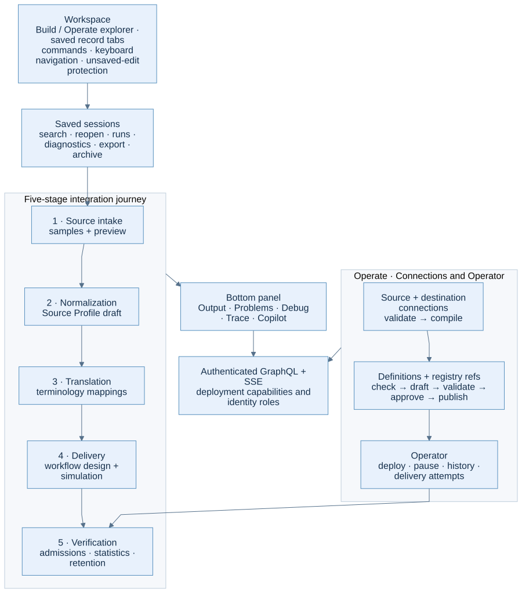

# fi-fhir UI (SvelteKit)

This directory contains the integration workspace and Mapping Studio for fi-fhir.



## Goals

- Strictly typed frontend (TypeScript + generated API clients).
- Strict contracts between frontend and backend:
  - GraphQL schema: `../internal/api/graphql/schema.graphql`
  - OpenAPI spec: `../api/openapi.yaml`
- CI enforces codegen drift (generated artifacts must be committed and up to date).

## Design docs

- `ui/docs/ARCHITECTURE.md`
- `ui/docs/FEATURES.md`
- `ui/docs/ITERATION-LOOP.md`
- `ui/docs/DEVELOPER-GUIDE.md`
- User guide: `docs/user-guide/ide.md` (repo root; `ui/docs/USER-GUIDE.md` points there)

## Commands

Requires Node.js 22.15 or newer and npm 10.9.3.

```bash
cd ui
npm install
npm run dev

# Type checks
npm run check
npm run typecheck

# Contract/codegen
npm run codegen
npm run codegen:check
```

GraphQL code generation reads the local schema and operation files in `codegen.yml`.
The `@graphql-tools/utils` 12.0.3 override in `package.json` fixes
[the upstream prototype-pollution advisory](https://github.com/ardatan/graphql-tools/security/advisories/GHSA-7mx3-vvmw-hjmv)
while preserving the current generated types. This combination is validated for
local SDL inputs. Before adding remote or executable schemas, upgrade Codegen and
its executor/delegate dependencies together: the older executors use a variable
format that is incompatible with utils 12. Run `npm run codegen:check` after any
change to this toolchain.

### Local dev with a running API server

The UI expects same-origin `/graphql`, `/api`, and `/health`. When running `npm run dev`, the dev server proxies those paths to `VITE_API_ORIGIN` (default: `http://localhost:8081`):

```bash
VITE_API_ORIGIN=http://localhost:8081 npm run dev
```
